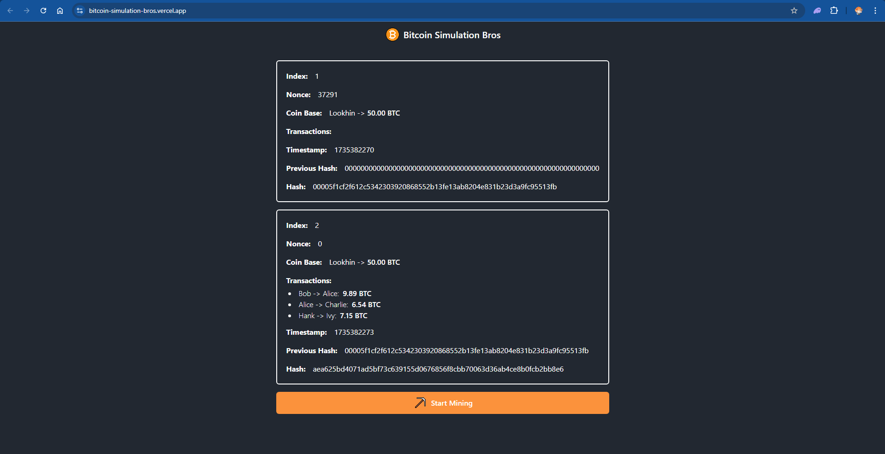

# Bitcoin Simulation Bros



A lightweight and interactive web-based Bitcoin blockchain simulation. This project demonstrates the core mechanics of blockchain mining, transaction processing, and hash calculation in a fun and educational way.

## 🌟 Features

- **Real-time Blockchain Mining**: Simulate the mining process with adjustable difficulty levels.
- **Transaction Processing**: Add and verify transactions in a block.
- **Dynamic Nonce Adjustment**: Visualize how the nonce changes to meet the block difficulty.
- **Hashing Demonstration**: Observe the SHA-256 hash generation in real-time.
- **Responsive UI**: Built with modern web technologies for seamless interaction.

## 📦 Technologies Used

- **[Rust](https://www.rust-lang.org/)**: High-performance systems programming language.
- **[Leptos](https://leptos.dev/)**: Reactive front-end framework for Rust.
- **[SHA-256](https://docs.rs/sha2/latest/sha2/)**: Secure hashing algorithm for block and transaction validation.

## 🚀 Getting Started

### Prerequisites

- Install [Rust](https://www.rust-lang.org/tools/install)
- Install `cargo-leptos`:
  ```bash
  cargo install cargo-leptos
  ```

---

### Installation

1. Clone the repository:

   ```bash
   git clone https://github.com/yourusername/bitcoin-simulation-bros.git
   cd bitcoin-simulation-bros
   ```

2. Build and run the project:

   ```bash
   cargo leptos watch
   ```

3. Open your browser and navigate to:
   ```
   http://localhost:8080
   ```

## 🤯 Start Project with WASM

```bash
npx tailwindcss -i ./input.css -o ./tailwind.css --watch
```

```bash
trunk serve --open
```

## ⚒️ WASM Production Build

```bash
trunk build --release
```

## 🤯 Usage

1. **Adjust Difficulty**: Set the difficulty level for mining by changing the `DIFFICULTY` constant in the code.
2. **Mine a Block**: Click the **"Let's Mining"** button to start mining.
3. **View Real-Time Updates**: Watch the `nonce` and `hash` update dynamically as the block is mined.
4. **Explore Transactions**: Add custom transactions and observe their impact on the block’s hash.

## 🔗 References

- [Bitcoin Whitepaper](https://bitcoin.org/bitcoin.pdf)
- [Leptos Documentation](https://leptos.dev/)
- [Rust Programming Language](https://www.rust-lang.org/)
